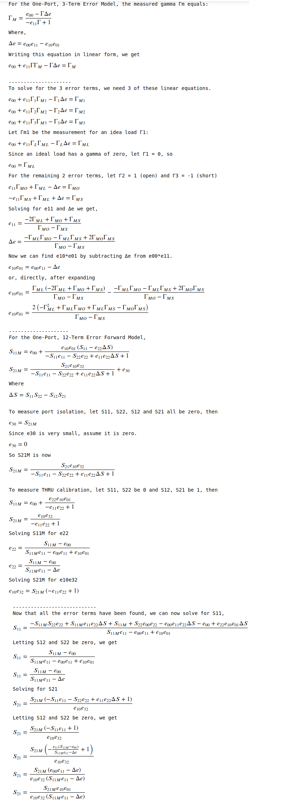

# Nanocli

## Introduction

Nanocli is a utility for running measurement
sweeps off the original NanoVNA or the new SAA2 (NanoVNAv2)
from the command line.
The sweep results are printed to the terminal
in touchstone format.

The utility provides its own error correction.
It does not use the onboard calibrations features
of either nano.
You must calibrate your nano separately to use this utility.
The calibration data is stored in a npz file on your computer.

Lastly, the utility takes steps not to disturb your nano UI settings.
So you can sweep a different range of frequencies using nanocli than what the UI is sweeping,
and the nano UI will be unaffected.
Nanocli will neither upset your nano UI calibrations nor your UI frequency sweep
settings.

## How to Use

After calibration, just issue the following on the command line.


```
$ nanocli
# MHz S MA R 50
0.01               0.0892     0.471     2.2561e-05    90.213     2.2561e-05    90.213         0.0892     0.471
2.5075           0.088949    -3.376     7.7961e-06    83.837     7.7961e-06    83.837       0.088949    -3.376
5.005            0.088878    -6.562     1.8099e-05    80.177     1.8099e-05    80.177       0.088878    -6.562
7.5025           0.088862    -9.750      1.167e-05   106.867      1.167e-05   106.867       0.088862    -9.750
10               0.089019   -13.106     7.6575e-06   -98.161     7.6575e-06   -98.161       0.089019   -13.106
```


If an error gets thrown, like not being able to find the device or ValueError, try again
or reset your device.  None of the nanos have a perfect USB interface.

## Walkthrough

First initialize the calibration file, setting the 
frequency sweep.


```
$ nanocli --init --start 10e3 --stop 10e6 --points 101
```


Print details on the calibration file.


```
$ nanocli --info
start:   0.01 MHz
stop:    10 MHz
points:  101
samples: 3
cals:    <none>
```


According to the --details option, the calibration file currently has no calibration data.
So lets perform the SOLT calibrations.

```
$ nanocli --open
$ nanocli --short
$ nanocli --load
$ nanocli --thru
```

After calibration, any change in start, stop, and points will
cause new calibration points to be interpolated from the current
calibration for the sweep.  

Now let's run a sweep.  


```
$ nanocli --points 5
# MHz S MA R 50
0.01             0.089177     0.458     1.5898e-05    75.621     1.5898e-05    75.621       0.089177     0.458
2.5075           0.088973    -3.372     1.0276e-05   131.935     1.0276e-05   131.935       0.088973    -3.372
5.005              0.0889    -6.575     5.2271e-06    -8.404     5.2271e-06    -8.404         0.0889    -6.575
7.5025           0.088878    -9.756      6.526e-06   164.609      6.526e-06   164.609       0.088878    -9.756
10               0.089027   -13.119     6.0622e-06   -28.472     6.0622e-06   -28.472       0.089027   -13.119
```


Write a s1p file to stdout.


```
$ nanocli --gamma --points 5
# MHz S MA R 50
0.01             0.089187     0.481
2.5075           0.088956    -3.373
5.005              0.0889    -6.557
7.5025           0.088857    -9.754
10               0.089003   -13.106
```


Passing the --points option above
forces an interpolation of the calibration data
to the frequencies of the new sweep.  If this option was not given
the original 101 frequencies used for calibration would be swept
and without any interpolation of the calibration data.

## How to Install

First pip install the required python libraries by going into
the top directory of the repo and running:

```
$ pip install .
```

Another option is to build an executable file of nanocli.
To do this run:


```
$ sh build.sh
python res/zip.py -s 1 -o nanocli src/* src/*/*
echo '#!/usr/bin/env python3' | cat - nanocli.zip > nanocli
rm nanocli.zip
chmod 755 nanocli
```


## Command Line Usage

The utility's command line usage is as follows:


```
$ nanocli --help
usage: nanocli [-h] [--filename FILENAME] [--start START] [--stop STOP]
               [--points POINTS] [--samples SAMPLES] [--average] [--init]
               [--open] [--short] [--load] [--thru] [--server] [--host HOST]
               [--port PORT] [--device DEVICE] [--info] [--list] [--gamma]

optional arguments:
  -h, --help           show this help message and exit
  --filename FILENAME  calibration file (default: cal.npz)
  --start START        start frequency (Hz) (default: None)
  --stop STOP          stop frequency (Hz) (default: None)
  --points POINTS      frequency points in sweep (default: None)
  --samples SAMPLES    samples per frequency (default: None)
  --average            average samples (default: False)
  --init               initialize calibration (default: False)
  --open               open calibration (default: False)
  --short              short calibration (default: False)
  --load               load calibration (default: False)
  --thru               thru calibration (default: False)
  --server             enter REST server mode (default: False)
  --host HOST          REST server host name (default: 0.0.0.0)
  --port PORT          REST server port number (default: 8080)
  --device DEVICE      tty device name of nanovna to use (default: None)
  --info               show calibration info (default: False)
  --list               list available devices (default: False)
  --gamma              output only S11 (default: False)
```


## On Calibration

The utility uses the (incomplete, one path) 12-term error model to correct
sweep measurements.  This is the same SOLT
calibration method that you use to calibrate the nano from its UI.

To calibrate the nano using the utility, first initialize the
calibration file with your frequency sweep.
If the calibration
file already exists, it will be overwritten.  By default
the name of the file is cal.npz.

Once intialized the frequency sweep for a given calibration file is fixed.
All calibrations will use the same sweep range set in the calibration
file.  This is because all calibration data within a single calibration file
must have measurements for the same set of frequencies.

## Interpolation of Calibration Data

By default, no interpolation is performed
on your calibration data when making a measurement.  
The frequencies for the measurement sweep are taken directly from 
the calibration file.  

If the range of the frequency sweep
is changed on the command line from that given 
in the calibration file,
the calibration data will be interpolated
to the new range.

Remember, the frequency range cannot be changed
when doing calibration.  But when making a measurement
sweep it can.

## Measurement Report Formats

All measurement output from the utility is
written to the terminal (using stdout).
By default the output will be formatted
for a s2p touchstone file.  If the --one option
is passed on the command line the output will be
formatted for a s1p touchstone file.

## REST Server

Passing the --server option starts the REST server for
remote control of your NanoVNAs.

The following REST commands display or update the current
value of the corresponding command line setting.  For PUT
(or POST), pass the value of the option to set in the body 
of your request as a text string.  To reset all the options
back to their defaults use the /reset REST command

```
GET or PUT /start
GET or PUT /stop
GET or PUT /points
GET or PUT /samples
GET or PUT /average
GET /reset
```

To create, get details about, load or save a calibration file use the 
following REST commands.  To save the current calibration to a file or 
to load (ie. recall) a file as the current calibration, 
pass its name as a text string in the request body.

```
GET /init
GET /info
PUT /save
PUT /recall
```

The following REST commands will perform a sweep on a NanoVNA and then
either save the results to the current calibration or return the results
in the response body using the touchstone file format.

```
GET /
GET /gamma
GET /open
GET /short
GET /load
GET /thru
```

For example to create a current calibration from 7.000Mhz to 7.060 MHz, use:

```
$ curl -d 7.00e6 http://localhost:8080/start
$ curl -d 7.06e6 http://localhost:8080/stop
$ curl -d 5 http://localhost:8080/samples
$ curl http://localhost:8080/init
$ curl http://localhost:8080/open
$ curl http://localhost:8080/short
$ curl http://localhost:8080/load
$ curl http://localhost:8080/thru
$ curl http://localhost:8080/
```

## Python Interface

Import this library using import nanocli.  The function
getvna is provided.  After passing it the cal file, 
the device name, the start frequency, the stop frequency, and 
the number of frequency points to measure, it returns a function which 
performs the measurement returning a (freq, data) tuple result.
freq is an array of frequencies points.  data is a 2xN array
of s11 and s21 calibration corrected measurements.

The interface for sweep is as follows.  Changing the range
for the frequency sweep by passing values for
start, stop or points will force an interpolation of the calibration
data.

```python
sweep = getvna(device=None, filename='cal')
sweep(start=None, stop=None, points=None, gamma=False, samples=None)
```

For example:


```
$ python3 -c 'from nanocli import getvna; f,d = getvna()(points=5); print(d)'
[[ 8.9177208e-02+7.1646700e-04j -6.4000000e-08+1.6140000e-05j]
 [ 8.8788664e-02-5.2337000e-03j -4.0400000e-07+3.1960000e-06j]
 [ 8.8302160e-02-1.0172559e-02j -1.0910000e-05+2.6207000e-05j]
 [ 8.7589904e-02-1.5075929e-02j  5.5150000e-06+2.3049000e-05j]
 [ 8.6698872e-02-2.0184022e-02j  3.8930000e-06-1.6855000e-05j]]
```


## Reason for This Utility

I needed the ability to perform a calibrated measurement from the terminal
or from a Jupyter Notebook, for example.  The original nano
had this ability through its (USB) serial interface and its "data" command.
However the new SAA2 does not.  It uses a special binary
protocol. Its measurements over the USB interface are also uncalibrated unlike the original nano. 
Lastly and probably, most importantly, you cannot control its UI
over USB.  So no more computer remote control visual operation of the
device like I was able to do with the original nano.
As a result this utility is intended to unify the two nanos to satisfy my above need
and do my remote control in Jupyter instead.

## Implementation Notes

In order to perform a measurement sweep on the original nano, the
utility first turns calibration off on the device.  Once the
measurement is made, the utility will turn calibration back on.
For the SAA2 nano, since its USB connection is always uncorrected
its UI is unaffected.

## Supported Nanovna Versions

For the NanoVNA, only versions 0.7.1 and higher of the firmware are supported.

## Derivation of Calibration

See the papers on Network Analyzer Error Models and Calibration Methods
by Doug Rytting.




